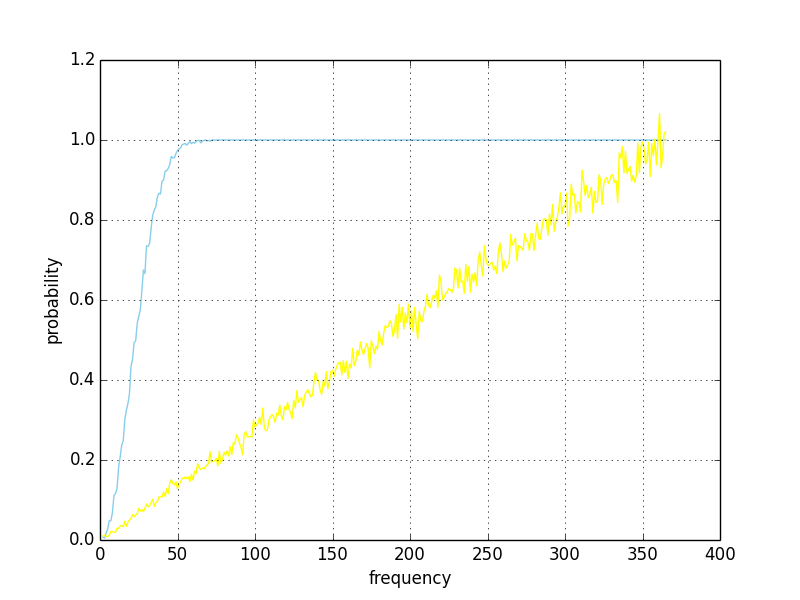

## bloom filter

布隆过滤器，类似于 BitMap ，也有一个很大的比特存储空间 N。

然后对数据经过 K 次不同的哈希，在比特表里将每个哈希值的位置置为1。

如果某条数据的每个哈希值都已被置1，说明他可能有重复。

布隆过滤器会出现误判，比如说其实没有重复，但是被判断成重复。但是不会有错判，将一个有重复的值，判断为没有重复。

python 的里的布隆过滤器，常用 bitarray 实现。

其主要参数为 N,K,哈希函数，影响布隆过滤器的效率。

## bitmap

BitMap 位图的一个常见应用场景是 40亿数字 去重，排序，判断重复 等操作。

按照都是整形4个字节计算，40亿个数字大概占用 4000000000 * 4 / 1024 / 1024 / 1024 = 14.9 G 内存

一般计算机是没有这么大内存的，也就是说无法放下这么多整形。

按照一般计算机4G大小内存计算，4 * 1024 * 1024 * 1024 / 4 / 10000 / 10000 = 10.7 亿

所以一般计算机内存只能放下大概10亿整形，40亿整形是无论如何不能直接计算的。

一般对于这种问题，就可以采用 BitMap 求解。

对于40亿整形数字，我们并不直接存储数字，而是构建一个长度为 整形的最大值 长度的 BitMap。

整形的最大长度为 2^(4 * 8) - 1 = 4294967295, 所以构架一个长度为 4294967295 长度的 BitMap ，占用内存大小为 512 M 

对于 500M 大小的占用来计算 40 亿数字，还是非常划算的，每个数字代表其在 BitMap 中的位置，将其置为1。

在所有数字放入位图中后，再从头读起，依次取出元素位置，即是去重排序之后的结果。

## 生日悖论

在一百个人里，存在与你在同一天过生日的人，概率很低是 100/365.（不考虑2月29号生日）

但是在一百个人里存在两个人在同一天生日的概率，却已经几乎 100%

是不是非常的反直觉？看下数据

